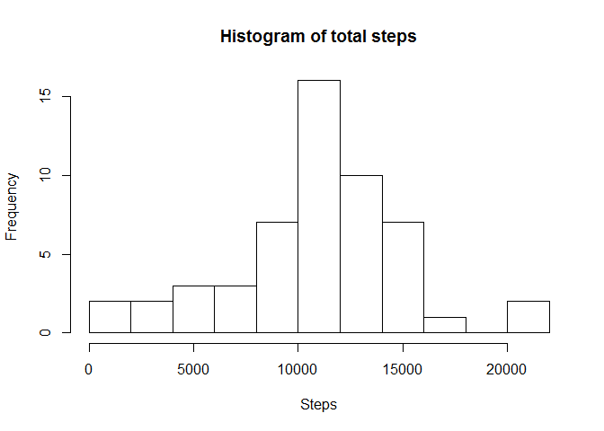

# Reproducible Research: Peer Assessment 1
kfranics  
May 20, 2016  

The first step is to set the default options for displaying R code in the output.

```r
library(knitr)
opts_chunk$set(echo = TRUE)
options(scipen=999) #turning off scientific number format
```


## Loading and preprocessing the data  
In this step I am loading and preprocessing the data.

```r
unzip("activity.zip")
activity <- read.csv("activity.csv", header = TRUE)
activity$steps <- as.numeric(activity$steps)
activity$date <- as.Date(activity$date)
```

  
  
  
## What is mean total number of steps taken per day?    
####Below is a histogram of the total number of steps taken each day, followed by the mean and median values.

```r
nr.of.steps <- aggregate(x = activity$steps, by = list(activity$date), FUN = "sum")
names(nr.of.steps) <- make.names(c("date","tot_steps"))
#Histogram - using Freedman-Diaconis rule for the breaks
hist(nr.of.steps$tot_steps, breaks = "FD",
     main = paste("Histogram of total steps"), xlab = "Steps")
```

<!-- -->

```r
stepmean <- round(mean(nr.of.steps$tot_steps,na.rm=TRUE))
stepmedian <- round(median(nr.of.steps$tot_steps,na.rm=TRUE))
```
For the step summary, the mean is 10766 and the median is 10765.

## What is the average daily activity pattern?  
###And now for the plot of the average daily activity pattern.

```r
avg.steps <- aggregate(activity$steps, list(activity$interval), mean, na.rm=TRUE)
names(avg.steps) <- make.names(c("interval","avg.steps"))
plot(avg.steps$interval, avg.steps$avg.steps,  type = 'l', 
     main = "Average Daily Activity - Steps across days", 
     xlab = "interval", ylab = "steps")
```

<!-- -->

```r
maxstepval <- avg.steps[which.max(avg.steps$avg.steps),]$interval
```
The interval with the largest number of steps is 835.  
  

## Imputing missing values  

```r
na_steps <- table(is.na(activity$steps)) #true values in index[2]
activity2 <- merge(activity, avg.steps, by="interval")
#using the interval average step for the NA steps
activity2$steps_cmp[is.na(activity2$steps)] <- activity2$avg.steps[is.na(activity2$steps)]
activity2$steps_cmp[!is.na(activity2$steps)] <- activity2$steps[!is.na(activity2$steps)]
#cleaning up columns for a more direct comparison to the original table
activity2$steps <- activity2$steps_cmp
activity2 <- activity2[,1:3]
```
There are 2304 rows with NA values.  
I will now replace the null rows with the interval average.

###After handling the null records, the new summary can be seen below.


```r
nr.of.steps2 <- aggregate(x = activity2$steps, by = list(activity2$date), FUN = "sum")
names(nr.of.steps2) <- make.names(c("date","tot_steps"))
#Histogram - using Freedman-Diaconis rule for the breaks
par(mfrow=c(1,2))
hist(nr.of.steps$tot_steps, breaks = "FD", ylim = c(0,25),
     main = paste("Original Histogram of total steps"), xlab = "Steps")
   
hist(nr.of.steps2$tot_steps, breaks = "FD", ylim = c(0,25),
     main = paste("Revised Histogram of total steps"), xlab = "Steps")
```

<!-- -->

```r
stepmean2 <- round(mean(nr.of.steps2$tot_steps))
stepmedian2 <- round(median(nr.of.steps2$tot_steps))
```
After replacing the NA values for the step data, the revised mean is 10766 and the median is 10766.  Hmm.. that's not much different from a mean of 10766 and a median of 10765.  For the total steps, there is a greater difference in the frequency distribution. This can clearly be seen in the histogram, surrounding the range of the mean.  

## Are there differences in activity patterns between weekdays and weekends?  
###Now I will take a look at the weekday vs weekend activity.  

```r
activity2$dow <- weekdays(activity2$date, abbreviate = TRUE)
activity2$weekday <- as.factor(ifelse(activity2$dow %in% c("Sat","Sun"),"weekend","weekday"))

avg.steps2 <- aggregate(activity2$steps, list(activity2$interval, activity2$weekday), mean)
names(avg.steps2) <- make.names(c("interval","weekday","avg.steps"))

library(lattice)
xyplot(avg.steps~interval | factor(weekday), layout = c(1,2),
                data=avg.steps2, main="Steps vs Interval", 
                xlab="Interval", ylab="Number of Steps", type='l')
```

<!-- -->

The activity appears to be similar between weekdays and weekends. There is a notable spike, roughly surrounding the interval that had been identified as having the maximum number of steps. Generally, in the central section of the intervals, there appear to be fewer steps on weekdays.
